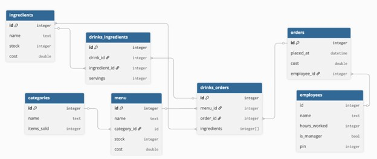

# Team_Gang_01_Project-2

This is our Point-of-Sale (POS) system project for **ShareTea Boba 🍹**.  
We wanted to design something that’s easy for cashiers to use during busy rushes, while also giving managers the tools they need to track sales, inventory, and overall business performance.

---

## ✨ Features
- **PIN-based login** → Cashiers and Managers each get their own interface.  
- **Cashier side** → Handles transactions, lets customers customize their drinks (ice, sweetness, toppings), and keeps track of current orders.  
- **Manager side** → Shows sales data, inventory levels, helps figure out peak days, and tracks employee information.  
- **Database-backend** → Keeps everything structured for easier expansion later.  

---

## 🚀 Project Phases
### Phase 0: UI Design & Research
We started by sketching out what we wanted the system to do.  
Two main user roles came up:  
- **Cashier** → fast and simple interface for order entry.  
- **Manager** → dashboard with data insights.  

We decided to use a simple PIN login system to switch between roles.

### Here is the cashier's screen: 
### Here is the manager's screen: 

### Phase 1: Database Design
We created an ERD (entity-relationship diagram) to plan out how the data would be stored.  
Main tables:  
- `employees` → staff info and hours worked  
- `orders` → transactions tied to employees  
- `menu` → drinks, inventory, and cost
- `drink orders` → drinks in each order
- `drinks ingredients` → ingredients in each drink 
- `ingredients` → inventory tracking  
- `categories` → statistics tracking

### Here is how we have designed our database: 

### Phase 2: Populating the Database (current phase)
Right now, we’re adding sample data to the database so we can test the system with real demo scenarios. Once that’s done, we’ll hook it up to the UI for a working prototype.  

---

## 📂 Project Structure (TODO)
